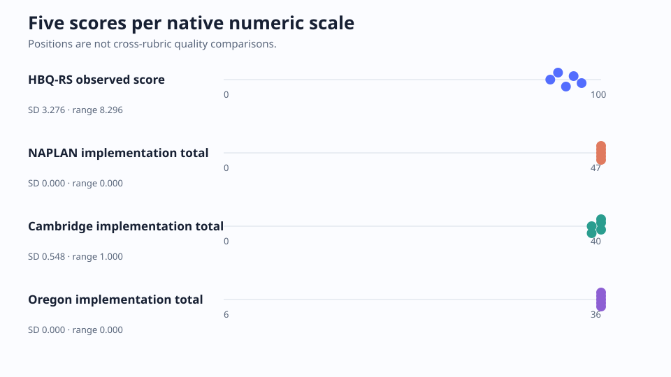
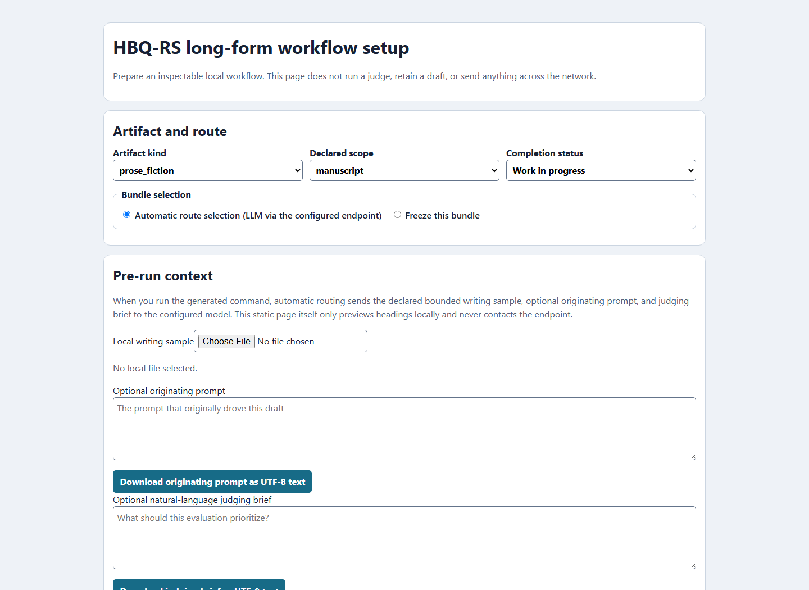
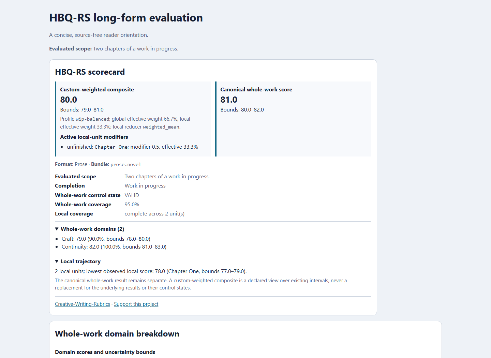

# Creative-Writing-Rubrics

**CWR 1.2.3 ships HBQ-RS 1.2.1**: a local-first toolkit for turning a review
brief into small, inspectable questions about creative work, then aggregating
the answers deterministically. It supports draft review, critique, model and
dataset evaluation, benchmarking, and synthetic-data workflows without hiding
the rubric, coverage, or uncertainty behind one opaque score. It does not turn
a literary judgment into an unquestionable truth.

The current HBQ-RS content contains **278 modules**, **2,145 atomic leaves**,
and **85 bundle presets**. A judge answers one yes/no leaf at a time;
aggregation is code, not another model call. Stable module, question, criterion,
and bundle IDs are the public contract.

## What the public evidence says

The strongest public evidence is deliberately bounded:

- In the [established-rubric repeatability study](evaluation-results/the-part-that-arrives-first-repeatability/established-v4/), one complete authorized story was judged five times with GPT-5.6 Sol. HBQ-RS had 91.01% all-five leaf agreement, 97.08% mean modal-label agreement, and no total-score ceiling; the comparison rubrics were more ceiling-bound on this case. This demonstrates repeatability and available headroom for one story, not general validity or literary superiority.
- The [Gray Blood full-book V9 aggregate](evaluation-results/hbq-gray-blood-full-book-qpc24-rebaseline-v9-public-result-v1/) is a settled full-fidelity aggregate for a work-in-progress manuscript, with no sampling: author-original `63.0202` (8 units / 1,817 positions) versus the explicitly labeled GPT-5.6 Pro rewrite `73.2369` (7 units / 1,589 positions), a difference of `+10.2167`. The non-statistical result is diagnostic for this rubric, scope, and frozen design, not a general ranking.
- The original full-rubric [Fresh88 generated-only HANNA analysis](evaluation-results/hbq-human-alignment-v3-fresh88-overlap-analysis-v1/) is negative: across 80 generated stories, final-score Spearman was `-0.0441` and the six-dimension macro was `-0.0361`. Later prompt-level MAE improvements below do not retroactively validate that full-rubric result.
- A [four-cell Sol descriptive follow-up](evaluation-results/hbq-human-alignment-optimizer-v5-grok-descriptive-sol-validation-result-v1/) on two development prompt groups observed equal-group MAE `0.9236111111111112` for `candidate-102cc7f06c9a99a7` and `0.788888888888889` for `candidate-69720ac6257db007` (`-0.1347222222222222`, a `14.586466165413528%` relative reduction). Its local Codex lifecycle does not prove native endpoint contact cardinality; it is neither selection nor confirmation evidence, does not establish general HANNA alignment, and does not pool endpoints or grant promotion/runtime authority.
- The [frozen Fresh88 HANNA confirmation](evaluation-results/hbq-human-alignment-optimizer-v5-f20-confirmation-grok-replay-v2-native-json-normalization/) now compares baseline with `broader-nextwave-13-missing_evidence_not_no` across 19 untouched items, eight prompt groups, and 38 endpoint-neutral cells: Grok moved from equal-group MAE `1.2569444` to `0.9375` (`25.414%` reduction), while the separate [Sol confirmation](evaluation-results/hbq-human-alignment-optimizer-v5-f20-confirmation-sol-reconcile-v3-final-message/) moved from `1.4267361` to `1.2439236` (`12.813%`). The exact descendant is published as a reconstructable [development profile](evaluation-results/hbq-human-alignment-optimizer-v5-f20-recommended-development-profile-v1/). This is held-out Fresh88 evidence only: endpoints are not pooled, the result grants no runtime dependency or promotion, native contact cardinality is unproven, and the Grok baseline includes two incomplete-coverage cells.
- The [next-wave Grok HANNA development result](evaluation-results/hbq-human-alignment-optimizer-v5-f20-nextwave-grok-score-result-v1/) covers three frozen development prompt groups and 33 cells: baseline equal-group MAE `0.9259` versus `0.75` for `normalized-nextwave-08-conservative-hybrid` (a `19%` reduction). Its [development-only optimizer readout](evaluation-results/hbq-human-alignment-optimizer-v5-f20-nextwave-development-optimizer-v1/) completed all `198/198` Optuna `4.9.0` grid trials; DSPy `3.3.1` validated 11 frozen evidence examples and signatures with zero LM calls. The unchanged [six-cell Sol check](evaluation-results/hbq-human-alignment-optimizer-v5-f20-nextwave-sol6-validation-result-v1/) moved in the same direction (`9.39%`). The subsequent [seven-group Grok result](evaluation-results/hbq-human-alignment-optimizer-v5-f20-broader-development-grok-result-v2-v3-exec/) found a lower-MAE descendant, `broader-nextwave-13-missing_evidence_not_no`: `0.9881` for candidate08 versus `0.7381` for the descendant (`25.3%`). Its unchanged [21-cell Sol validation](evaluation-results/hbq-human-alignment-optimizer-v5-f20-broader-development-sol-result-v1/) also improved: baseline `1.2476`, candidate08 `1.1540`, and the descendant `1.0675` (`14.44%` below baseline and `7.50%` below candidate08). These remain endpoint-separated development results—not confirmation or general alignment—and grant no promotion or runtime authority.
- The subsequent [Fresh96 confirmation](docs/RESULTS.md#fresh96-confirmation-the-retained-smaller-edit-holds-on-sol) tested baseline versus retained child20 on 32 untouched items / 16 groups with identical frozen payloads across endpoints. Grok MAE fell `28.65%` (`1.04514` to `0.74566`); Sol fell `17.95%` (`1.35009` to `1.10781`). Each improved on 15 groups. One Sol baseline coverage flag is false and its numeric score is retained. This is bounded prompt-level confirmation, not general literary validity or automatic runtime promotion; the [development journey](docs/VALIDATION_AND_REPAIR_JOURNEY.md#fresh96-confirmation-smaller-edits-transfer-again) stays outside this README.
- The [CWR-guided revision V9 result](evaluation-results/cwr-guided-revision-gain-v2-live-exec-v9-historical-input-replay-result-v1/) independently recomputes 40 endpoint judgments, including 16 guided-control and 32 arm-baseline comparisons, only from the exact completed external V7 evidence root plus the pinned historical V6 executor. Every guided-control comparison was positive: mean holistic/compact differences were `+2.25`/`+2.25` for Sol and `+1.75`/`+1.50` for Grok. Endpoints remain separate; Sol contact cardinality is unproven, and the result makes no provider-ranking or generalization claim.



*Five repetitions of one story, keeping each rubric on its native scale. The
chart is a repeatability view, not a cross-rubric quality ranking; its numbers
and SVG are bound by the study's result manifest and verifier.*

These results show what the system can make inspectable today: repeatability,
scope-aware reports, explicit uncertainty, and bounded comparisons. They do
not complete human-alignment validation, establish reader outcomes, or create a
default hierarchy of literary quality.

## Active work, not results

The [V8 multisample continuation](evaluation-results/hbq-multisample-repeatability-v1-remainder-capacity-reset-successor-v8/)
is an **unpublished operational continuation**, proceeding one settled,
trace-bound sequence at a time. Its exact live sequence count is not promoted
here; it becomes a public repeatability result only after completion and
integrity-checked analysis.

The live release-facing work is narrower than the historical experiment log:

- [HANNA development and confirmation](docs/RESULTS.md#hanna-prompt-development-and-held-out-confirmation)
  now has endpoint-separated Grok-primary/Sol-validation results, including the
  Fresh96 confirmation summarized above. DSPy and Optuna remain
  development-only and have no production runtime authority.
- [CWR-guided revision gain](evaluation-results/cwr-guided-revision-gain-v6-heldout-result-v1/)
  now includes a four-item held-back comparison. Guided-minus-generic means
  were Sol `+1.00` holistic / `+0.75` compact and Grok `+0.75` / `0.00`.
  This small, endpoint-separated result does not establish general benefit.
- [Matched Grok/Sol calibration](evaluation-results/hbq-grok-sol-current-matched-v1/)
  remains a provider-free public-synthetic screen, not judge-interchangeability
  evidence.
- [Flash-Next/Linux planning](evaluation-results/hbq-supplemental-providers-flash-next-v1/)
  and its [portability diagnostic](evaluation-results/hbq-supplemental-providers-flash-next-linux-portability-v1/)
  remain explicit NO-GO evidence pending native Linux execution, identity,
  pairing, and promotion gates.

## Install and try it

```bash
pip install "git+https://github.com/HaileyStorm/Creative-Writing-Rubrics.git"
```

From a clone, install development dependencies with `pip install -e ".[dev]"`.
HANNA prompt-development work additionally uses
`pip install -e ".[dev,hanna-dev]"`; DSPy and Optuna remain development-only.
Python 3.10+ is supported. The CLI is `cwr` (with `hbq` as an alias).

Score the included example verdicts, inspect a bundle, or render a
provider-agnostic packet:

```bash
cwr score prose.scene examples/verdicts_example.jsonl
cwr list bundles
cwr show prose.scene
cwr render-judge --bundle prose.scene --artifact examples/sample_scene.md
```

For a real judge, bring a local OpenAI-compatible endpoint:

```bash
cwr judge examples/sample_scene.md --bundle prose.scene --provider openai \
  --base-url http://127.0.0.1:8000/v1 --model local-model \
  --output-dir ../cwr-runs/sample
```

See [Running a headless judge](docs/judging.md) for Codex, Grok Build, the
Windows Nous bridge, privacy disclosure, contracts, retries, resume, and
full-fidelity long-form runs. Sampling is always explicit; omit
`--local-sample-limit` when complete local coverage is intended.

## How it works

```text
artifact + brief → validated route → frozen task contract → stable map
→ per-leaf verdicts → deterministic score → report
```

Choose a bundle, optionally freeze an artifact-bound task contract, collect
`YES`, `NO`, `NOT_APPLICABLE`, or `CANNOT_ASSESS` verdicts, and score them with
the library. Objective, explicitly non-negotiable task requirements may become
gates; author goals remain weighted questions. Open-ended review can attach
findings, but it does not rewrite scores.

For long-form work, the global result and local chapter/section diagnostics are
separate. The default is full local coverage; an explicit sample is a
diagnostic subset and is labeled as such. Reports preserve observed scores,
coverage, unresolved bounds, evidence scope, and control states rather than
collapsing them into one unsupported quality claim.

The optional GUI is an offline helper, not a server or telemetry system:

<p>
  
</p>

Offline reports and scorecards keep the canonical whole-work result separate
from any custom weighted composite:

<p>
  
</p>

## What is in the box

| Path | Contents |
| --- | --- |
| `registry/` | Modules, generated aggregates, question index, and criterion ownership |
| `bundles/` | Bundle presets |
| `schema/` | Module, bundle, judge-response, verdict, score-report, and review schemas |
| `prompts/judge/` | Prefix, binary, decomposition, pairwise, long-form, multimodal, and import prompts |
| `prompts/review/` | Open-ended critique families; findings do not rewrite scores |
| `src/hbqrs/` | Library and CLI |
| `docs/HBQ_RS_STANDARD.md` | Normative HBQ-RS rules |
| `docs/RUBRIC_BOOK.md` | Human-readable rubric catalog |

Technique-specific model-build modules are optional. Literary judging does not
require them.

## Results, guides, and integration

Start with the [curated results hub](docs/RESULTS.md), which groups the public
evidence by purpose and labels repeatability, full-book comparisons, negative
or no-promotion results, exploratory work, and historical packages. It also
links the detailed preface, HANNA, figurative, L2, structural-audit,
exact-repeatability, and provider-supplement records rather than flattening
every study into this front page.

- [HBQ-RS standard](docs/HBQ_RS_STANDARD.md) and [rubric catalog](docs/RUBRIC_BOOK.md)
- [Using HBQ-RS inside another application](docs/apps.md)
- [Validation and repair journey](docs/VALIDATION_AND_REPAIR_JOURNEY.md)
- [Leaf decomposition policy](docs/LEAF_DECOMPOSITION_POLICY.md)
- [Benchmarking](docs/benchmarking.md), [model training](docs/training.md), and [synthetic data](docs/synthetic-data.md)
- [Palimpsest integration handoff](docs/PALIMPSEST_HANDOFF.md), including its exact-pinned submodule and compatibility boundary

## Boundaries that matter

- Keep the selected bundle and evidence scope appropriate to the task; do not attach every module by default.
- Treat `CANNOT_ASSESS` as unresolved evidence, not as `NO`.
- Keep user taste and post-candidate preferences separate from craft requirements.
- Do not reward length, verbosity, ornament, or bland compliance by default.
- Request concise evidence, not private chain-of-thought.
- Label author-original prose and model rewrites explicitly; public case studies expose only authorized excerpts and aggregates.

Scores are structured evidence, not literary truth. Calibrate before
consequential use.

## Python API

```python
from hbqrs import compile_bundle, load_bundles, load_modules, load_verdicts
from hbqrs import resolve_bundle, score_bundle

modules = load_modules("registry/all_modules.json")
bundle = resolve_bundle(load_bundles("bundles/all_bundles.json"), "prose.scene")
packet = compile_bundle(modules, bundle)
report = score_bundle(modules, bundle, load_verdicts("examples/verdicts_example.jsonl"))
print(report["status"], report["final_score"])
```

## Verification, license, and support

Release checks cover fresh-clone and isolated-wheel installation, CLI and
Python APIs, strict schemas, local endpoint transport, public-result verifiers,
and provider-adapter/evidence-validation paths. Actual remote-execution
evidence is package-specific and explicitly labeled. The
public case studies preserve their own contracts, manifests, aggregate outputs,
and privacy checks; private manuscript prose and raw model responses are not
distributed.

This project is Apache-2.0 licensed; see [LICENSE](LICENSE) and [NOTICE](NOTICE).
Optional donations and their safety notes are documented in
[docs/DONATIONS.md](docs/DONATIONS.md).
