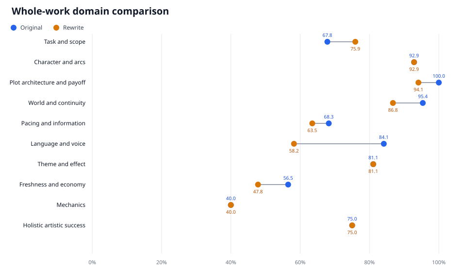
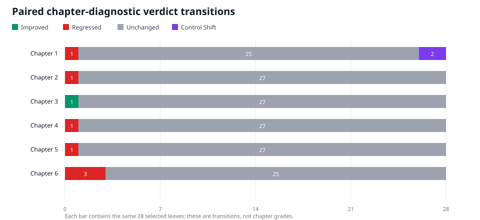

# Gray Blood, Chapters 1–6: draft comparison

This case study compares two versions of the same work-in-progress dark-fantasy novel. *Gray Blood* centers on blood-powered magic, its human cost, and the people willing to treat that cost as a system to be understood or exploited.

Madison, the first-person narrator, is a nineteen-year-old computer-science student whose technical fascination begins to outrun her moral caution. Amelia is her witch partner: affectionate and secretive, medically trained, capable of startling violence, and Madison's first route into the magical world. FAWN is a small research group of witches and human donors whose work gives Madison an independent route to magic—and introduces new questions about consent, coercion, and scalable power.

“Original” and “rewrite” cover the same six chapters. The evaluation asks whether the rewrite improves the opening while preserving its strongest material: constrained blood magic, Madison's programming-shaped fascination and moral slippage, a darker behavioral register for Amelia, and sustained relationship complexity.

## What was evaluated

- The automated `cwr longform` workflow: route, frozen task contract, source-preserving segmentation, whole-work map, complete `prose.novel` judging, four independent local diagnostics per draft, synthesis, and reports.
- 221 static bundle leaves plus 18 frozen task-contract leaves per draft, judged with GPT-5.6 Sol at Medium.
- Route selection, maps, and evidence-grounded synthesis with GPT-5.6 Sol at High.
- The same frozen 28-leaf chapter diagnostic selection for all twelve corresponding chapters, judged with GPT-5.6 Sol at Medium.

Whole-work scoring used the complete six-chapter source. Local scores and fixed chapter diagnostics remained independent and were never averaged. Open-ended synthesis organized the findings but could not alter a binary verdict or deterministic score.

## Result in brief

The original remains the stronger base across these chapters. It leads by 4.86 points and is stronger in plot, world continuity, pacing, language and voice, and freshness. The rewrite has slightly higher assessable coverage and a small task-goal-domain advantage, but those gains do not offset its broader losses. Character, theme/effect, mechanics, and holistic components tie in this run.

| Six-chapter draft | Control state | Observed score | Uncertainty bounds | Coverage |
| --- | --- | ---: | ---: | ---: |
| Original | `VALID` / `SCORED` | 78.92 | 76.41–79.57 | 96.83% |
| Rewrite | `VALID` / `SCORED` | 74.05 | 72.20–74.40 | 97.80% |

- **Control state** reports only objective, explicit non-negotiable requirements. Both drafts satisfy every applicable requirement; the offspring rule is `NOT_APPLICABLE` because that situation does not occur in these chapters.
- **Coverage** is the weighted share of applicable selected criteria that received an assessable `YES` or `NO` verdict.
- **Observed score** is the deterministic score from assessed criteria after capped penalties. It is not a probability or universal literary grade.
- **Uncertainty bounds** show the lowest and highest results still possible if currently unassessed relevant criteria resolve as failures or passes. They are not statistical confidence intervals.

Author goals—such as a grim-dark tone or a darker Amelia—carry score weight but are not control gates. An unfinished novel can miss one of those goals and remain fully judgeable.

## What the comparison found

### Strong material in both drafts

- Madison's systems-oriented fascination is convincing. She moves from observation to battery research, cost accounting, compiler-like analogies, and sustained symbol study.
- Blood magic has a coherent causal core: blood classes, stored power, intent, symbols, engraving, sensing, and termination all create usable story pressure.
- Madison and Amelia's relationship contains real complexity—love, deception, unequal knowledge, bodily risk, access dependency, and competing loyalties through FAWN.
- The blood economy, three-mother witch household, compromised research group, and programmer protagonist are more distinctive than the surrounding paranormal-romance beat sequence.
- The original's causal spine is particularly strong: every assessed plot-architecture point lands, with early medical, blood, and relationship setups paying off later.

### Where the rewrite helps

- It slightly improves the weighted task-goal component and resolves a little more of the selected evidence, producing higher coverage.
- Chapter 3 remains its clearest local success: the crisis, explanation, and magical demonstration are better integrated in the matched diagnostic pass.
- Madison's programmer lens, moral grappling, and early dark-path setup remain intact.

### Where the rewrite loses ground

- Plot convenience, continuity, exposition, repetition, and scene allocation cost it more than its task-goal gain recovers.
- Explicit ages and longevity benchmarks conflict with the supplied canon.
- Amelia's behavior is repeatedly softened by apology, reassurance, cheerfulness, or defensive explanation, working against the intended darker register.
- Later rules arrive too often as comprehensive instruction instead of costly action, disagreement, experiment, or failure.
- Copy-level defects remain pervasive in both versions; neither mechanics component rises above 1.6 of its 4 available points.

## Chapter diagnostics

Each chapter diagnostic contains the same 28 selected leaves. It records paired local verdict changes rather than a partial-bundle “chapter grade.”

| Chapter | Improved in rewrite | Regressed in rewrite | Other state change | Main reading |
| ---: | ---: | ---: | ---: | --- |
| 1 | 0 | 1 | 2 | Similar foundation; the rewrite loses one local advantage and changes assessability on two leaves. |
| 2 | 0 | 1 | 0 | The prolonged piano allocation weakens entry and momentum before the climber sequence. |
| 3 | 1 | 0 | 0 | The rewrite's clearest win: information is tied more effectively to crisis and demonstration. |
| 4 | 0 | 1 | 0 | A concrete longevity inconsistency weakens continuity. |
| 5 | 0 | 1 | 0 | Direct motive explanation reduces dramatized characterization. |
| 6 | 0 | 3 | 0 | The largest local regression, concentrated in exposition, pacing, and ending force. |

The automated local-score reports provide a second lens on representative units. They are deliberately shown one by one in [`automated/original/report.md`](automated/original/report.md) and [`automated/rewrite/report.md`](automated/rewrite/report.md), not collapsed into a chapter average.

## Most useful revision priorities

1. Rebuild Amelia's behavioral register around controlled darkness rather than default apology and reassurance. Keep tenderness, but make it selective and costly.
2. Let rules emerge through experiments, disagreements, errors, and consequences—using the rewrite's Chapter 3 as the model.
3. Maintain a compact continuity ledger for ages, blood classes, reserves, batteries, replenishment, compulsion, and engraving costs.
4. Give feeding, coercion, addiction, and killing visible aftermath and accountability.
5. Advance Madison's moral slippage through a consequential choice: she should recognize a cost and still choose information, access, or optimization.
6. Compress repeated romance, music, party, travel, recovery, and instructional beats before doing the final copyedit.

The full ranked comparison and evidence references are in [`comparative-synthesis.json`](comparative-synthesis.json).

## Data and reproducibility

- [`manifest.json`](manifest.json) records scope, routes, counts, and top-level results.
- [`whole/`](whole/) contains both complete 239-verdict runs and their full deterministic score breakdowns.
- [`automated/`](automated/) contains the two generated narrative reports, local-score figures, and eight complete sampled-unit runs.
- [`chapters/`](chapters/) contains twelve matched selected-question diagnostics and their verdicts.
- [`maps/`](maps/) contains sanitized unit maps, state ledgers, promises, motifs, and continuity conflicts.
- [`render_figures.py`](render_figures.py) regenerates the two comparison SVGs from the published score and diagnostic files.

Strict batch coverage also got a practical test: one 32-leaf response contained only 31 leaves. The runner rejected that batch, preserved the already accepted checkpoints, and resumed from the incomplete boundary; the partial response never entered a score.

The publication includes scores, verdict states, concise evidence references, and derived analysis. Manuscript prose and verbatim evidence quotations remain private.
