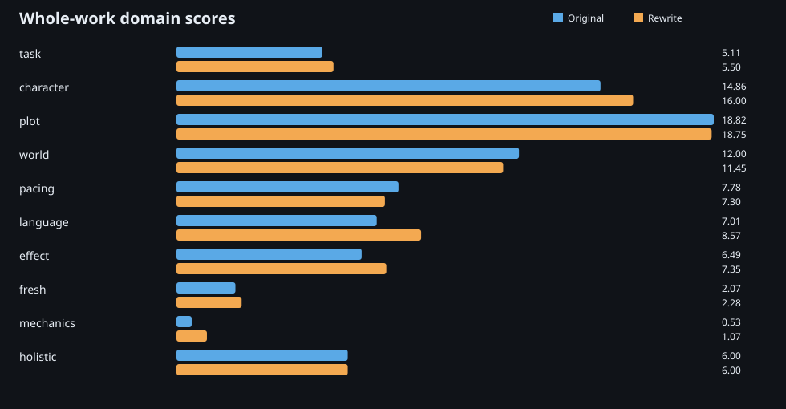
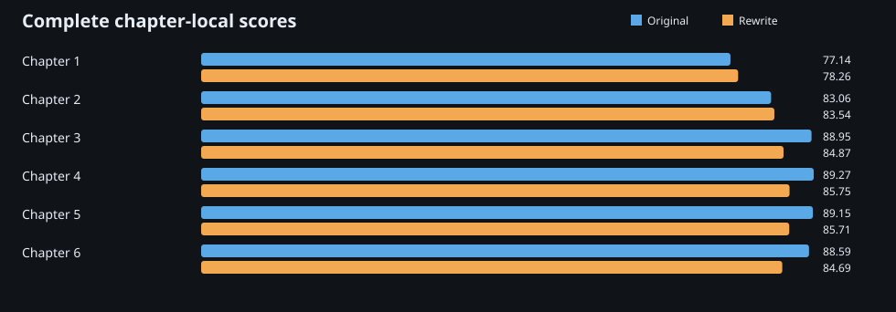

# Gray Blood, Chapters 1–6: current WIP comparison

This is a private-work-in-progress evaluation of two six-chapter drafts. It publishes the score structure and every accepted binary verdict, but not manuscript prose, evidence excerpts, prompts, model responses, local paths, or execution identifiers.

## Orientation

The opening follows Madison, a technically minded student drawn into blood-powered magic; Amelia, her witch partner; and FAWN, a research group that offers a second route into that world. The comparison asks how the two drafts handle that premise, the relationship, the rules and costs of power, and the opening's movement.

The rewrite leads the current complete whole-work view by 7.89 points. Both runs are `VALID` and `SCORED`; the difference is a diagnostic result for this rubric and scope, not a general verdict on either draft.

| Draft | Whole-work observed | Bounds | Coverage | WIP 70/30 composite |
| --- | ---: | ---: | ---: | ---: |
| Original | 75.52 | 75.52–75.52 | 100.00% | 78.67 |
| Rewrite | 83.41 | 82.95–83.54 | 99.42% | 83.53 |

`VALID` means every applicable objective control requirement was satisfied. **Coverage** is the weighted share of applicable criteria with a `YES` or `NO` verdict. **Observed** is the deterministic score from those assessed criteria after capped penalties. **Bounds** are the low/high results still possible if any `CANNOT_ASSESS` criteria resolve as failures/passes; they are not confidence intervals.

This is a WIP evaluation: completion-only leaves are `NOT_APPLICABLE`, while craft, continuity, and weighted author-goal leaves remain active for the supplied chapters. Author goals influence score but never determine `VALID`. The minimum score-coverage threshold is 80%.

The optional `balanced-wip-70-30` view uses 70% whole-work score and 30% equal-weight chapter mean. It is shown beside—not in place of—the whole-work and chapter views.

## Whole-work domains

| Domain | Original | Rewrite | Rewrite − original |
| --- | ---: | ---: | ---: |
| task | 5.11 | 5.50 | +0.39 |
| character | 14.86 | 16.00 | +1.14 |
| plot | 18.82 | 18.75 | -0.07 |
| world | 12.00 | 11.45 | -0.55 |
| pacing | 7.78 | 7.30 | -0.48 |
| language | 7.01 | 8.57 | +1.56 |
| effect | 6.49 | 7.35 | +0.86 |
| fresh | 2.07 | 2.28 | +0.22 |
| mechanics | 0.53 | 1.07 | +0.53 |
| holistic | 6.00 | 6.00 | +0.00 |

The rewrite gains in task, character, language, theme/effect, freshness, and mechanics. The original retains the stronger plot, world, and pacing totals. Holistic score is unchanged. These domain totals keep the comparison useful without pretending that one compact number tells the whole story.

## Chapter view

| Chapter | Original | Rewrite | Rewrite − original |
| ---: | ---: | ---: | ---: |
| 1 | 77.14 | 78.26 | +1.12 |
| 2 | 83.06 | 83.54 | +0.48 |
| 3 | 88.95 | 84.87 | -4.08 |
| 4 | 89.27 | 85.75 | -3.52 |
| 5 | 89.15 | 85.71 | -3.44 |
| 6 | 88.59 | 84.69 | -3.90 |

Each chapter received the complete `prose.chapter` bundle. This local view is a second scale of evidence, while the complete six-chapter `prose.novel` pass remains the manuscript-level result.

## Reading the publication

- [`reports/original.json`](reports/original.json) and [`reports/rewrite.json`](reports/rewrite.json) contain current global, 70/30, chapter, and domain score reports.
- [`verdicts/original.jsonl`](verdicts/original.jsonl) and [`verdicts/rewrite.jsonl`](verdicts/rewrite.jsonl) contain every accepted verdict with stable criterion IDs, scope, and confidence—without evidence text.
- [`comparison.json`](comparison.json) provides machine-readable domain and chapter deltas.
- [`privacy-audit.json`](privacy-audit.json) and [`verify_publication.py`](verify_publication.py) provide the audit and deterministic public-package checks.

This refresh uses a complete current protocol. It replaces the prior publication; it is **not** a sampled-to-full score comparison.

Results are comparable within this published protocol only. Do not compare its headline directly with an earlier headline: the protocol, reasoning configuration, and accepted-verdict set differ.

## Optional excerpt insertion point

No manuscript excerpt is published here. If the author later selects a short, non-sensitive passage, add it only with its relevant criterion results and a fresh privacy audit.
