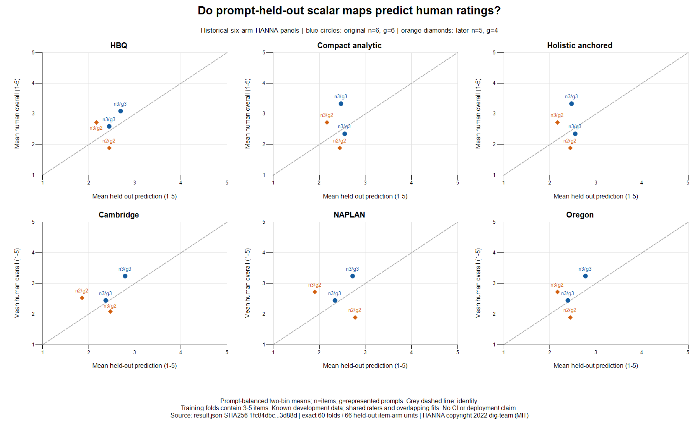

# Historical matched scalar calibration: prompt holdouts

This retrospective diagnostic asks whether an increasing postprocessing map of
each of six scalar arms predicts the already-opened human overall ratings better
than target-only training baselines. The original HBQ v1.0.0 cohort has six
stories and six prompts; the later v1.2.1 cohort has five stories and four prompts.
The cohorts stay separate. All arms use their frozen five-repeat means: 330
model scores, 66 item/arm units, 33 existing human annotations and 60 arm-specific
prompt folds. Four methods forecast the same units; they are not independent
trials. Human overall is the exact mean of six integer axes across three source
annotations per story, on the original 1-to-5 scale.

Before this new analysis, scalar and rater-influence outcomes and prior larger
dimension-calibration studies were known. The method/profile and corrected
source passed independent review before the single actual execution. This is
a known development panel, not unused confirmation.

Every fold withholds an entire prompt. Training weights give each remaining
prompt total weight one. Weighted least-squares increasing isotonic PAVA first
aggregates identical exact model scores; adjacent violating blocks are pooled.
Predictions interpolate linearly between distinct training-score knots and
clamp outside their range. The direction is fixed; no reversal is selected.
The [SciPy PAVA documentation](https://docs.scipy.org/doc/scipy/reference/generated/scipy.optimize.isotonic_regression.html)
describes the weighted monotone least-squares method; the runtime here is the
included exact-Fraction implementation, not SciPy.

The primary target-only baseline is the training weighted median (midpoint of
adjacent targets at an exact half-weight boundary); the secondary baseline is
the training weighted mean. Neither sees held-out targets. Native affine is
the fixed unit display `1+4*(score-min)/(max-min)`, not a learned calibration.
The primary loss averages absolute error within each held prompt, then equally
across prompts. MSE is secondary, in squared rating units. The paired primary
contrast is isotonic minus training median; negative means lower panel error.

| Cohort | Arm | Isotonic MAE | Training median MAE | Training mean MAE | Native affine MAE | Isotonic minus median | Raw / crossfit rho |
|---|---|---:|---:|---:|---:|---:|---|
| Original n=6, g=6 | Cambridge | 0.405 | 0.630 | 0.663 | 0.569 | -0.225 | 1.000 / 0.829 |
| Original n=6, g=6 | Compact analytic | 0.531 | 0.630 | 0.663 | 1.543 | -0.099 | 0.655 / -0.829 |
| Original n=6, g=6 | HBQ | 0.587 | 0.630 | 0.663 | 1.164 | -0.043 | 0.714 / -0.257 |
| Original n=6, g=6 | Holistic anchored | 0.531 | 0.630 | 0.663 | 1.554 | -0.099 | 0.655 / -0.829 |
| Original n=6, g=6 | NAPLAN | 0.439 | 0.630 | 0.663 | 0.149 | -0.191 | 0.943 / 0.771 |
| Original n=6, g=6 | Oregon | 0.394 | 0.630 | 0.663 | 0.825 | -0.236 | 0.943 / 0.829 |
| Later n=5, g=4 | Cambridge | 0.922 | 0.833 | 0.769 | 0.593 | 0.088 | 0.462 / -0.410 |
| Later n=5, g=4 | Compact analytic | 0.769 | 0.833 | 0.769 | 1.306 | -0.065 | undefined / -0.410 |
| Later n=5, g=4 | HBQ | 0.769 | 0.833 | 0.769 | 1.327 | -0.065 | -0.872 / -0.410 |
| Later n=5, g=4 | Holistic anchored | 0.769 | 0.833 | 0.769 | 1.306 | -0.065 | undefined / -0.410 |
| Later n=5, g=4 | NAPLAN | 1.067 | 0.833 | 0.769 | 0.767 | 0.233 | 0.600 / -0.410 |
| Later n=5, g=4 | Oregon | 0.769 | 0.833 | 0.769 | 0.778 | -0.065 | -0.718 / -0.410 |

Original HBQ's isotonic MAE is 0.586944 versus 0.629630 for the training median:
four prompt errors decrease and two increase. Its pooled crossfit Spearman is
-0.257143 despite raw-score rho +0.714286, so reduced absolute error does not
establish better discrimination. Later HBQ's isotonic forecasts equal the
target-only mean exactly on every item (MAE 0.768519, MSE 0.643347). Compact,
holistic and Oregon also equal that mean itemwise in the later cohort. There
is no added predictive information from their isotonic maps on this panel.

The calibration benefit is not universal: original NAPLAN native affine MAE
0.148976 is lower than isotonic 0.438829; original Cambridge native affine also
has lower MSE. Later Cambridge and NAPLAN isotonic lose to the training median.
Training-only constants can have negative pooled crossfit rank because each
fold has a different training target distribution. Constant later compact and
holistic raw scores have undefined raw rank, although their fold-specific
predictions have defined negative rank. Increasing within-fold fits do not
guarantee increasing pooled crossfit predictions or rank preservation.



The figure uses at most two bins per arm/cohort, selected by a distinct
prediction boundary nearest the item-count midpoint, with at least two items
per bin. Prediction ties are never split. Bin means use inverse full-cohort
prompt-size weights. Labels give item count n and represented prompt count g;
g counts across bins need not sum to the cohort g when one prompt spans bins.
Points are descriptive bin means, not a fitted deployment curve. The identity
line is a reference. No CI or significance is supplied for these tiny,
dependent, known panels; overlapping training sets and shared annotators
remain dependent. Individual targets and exact private folds are not published.

Existing [TRAIN48 calibration](../hbq-human-alignment-v3-fresh88-analysis-v1/README.md)
already contains prompt-group crossfit and learned no-feature mean/median
comparisons; those baselines outperform its feature ridge MAE. The separate
[TRAIN44 child20 calibration](../hbq-human-alignment-optimizer-v13-train-expansion-v1/README.md)
compares six-dimension affine calibration with fixed and raw baselines. This
package adds a matched six-scalar-arm question; it does not replace those
studies or claim their controls were missing. Neither the tiny scalar panels
nor earlier dimension fits establish a production absolute-quality scale.

`profile.json`, `source.py`, `result.json` and `execution.json` bind the method,
inputs, code and actual CPython runtime. Two focused guards passed: weighted
tied-score PAVA against an independent exhaustive partition optimum, and
held-prompt perturbations that leave training fits and forecasts unchanged.
Root readback checked saved exact fold disjointness, unique holdouts, weights,
knots, errors, contrasts, bin summaries and itemwise mean equality without
rereading source annotations/model scores or fitting again. Independent
aggregate review accepted the stated negative/limited conclusions.

Only previously selected annotation value vectors and the hash-bound historical
panel preflight are reused. The original source CSV, contemporary targets,
native collections, earlier bootstrap, Worker/Assignment IDs and source prose
are not reread or materialized by this analysis. Full input hashing accesses
bytes; this is not a byte-nonaccess claim. The [pinned HANNA source](https://github.com/dig-team/hanna-benchmark-asg/tree/282f27536a5d05ad4ce14298abcd70c45668fed2)
is copyright 2022 dig-team, with its MIT license retained in `HANNA_LICENSE.txt`.
No new provider calls, human votes, rubric/model change or promotion occurred.

Replay requires the original hash-bound private inputs and recorded CPython,
and a fresh output outside the repository and retained input roots:

```text
python -B source.py --annotations <private-selected-annotations.json> --source-root <frozen-330-score-root> --output <fresh-private-directory>
python -B test_source.py
```

`plot.ps1` renders only the published aggregate using the installed Windows
.NET Framework charting library, with no package installation or visible UI:

```text
powershell.exe -NoProfile -NonInteractive -File plot.ps1 -ResultPath <result.json> -OutputPath <fresh-calibration.png>
```

The full same-data matrix, contemporary endpoint evidence, other forms,
repeatability, revision utility and prospective release gates remain open.
