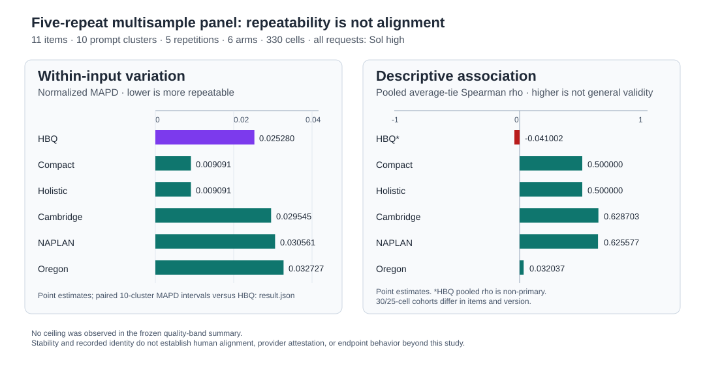

# Multisample repeatability: completed aggregate

**Weak human alignment is the headline, not something stability excuses.** This completed 330-cell, within-input repeat study found that the HBQ arm's pooled descriptive rank association with the available human reference was -0.041, despite substantial aggregate same-input leaf agreement. Repeatability is a measurement property, not evidence of quality, human alignment, or general validity.

The frozen study comprises 11 items in 10 prompt clusters, each scored five times, across six arms (330 cells). Every cell requested Sol at high reasoning. This packet intentionally exports only aggregate metrics and commitments: it contains no stories, prompts, item identifiers, per-item ratings, response bytes, or private run locations.

## Aggregate results

`Normalized MAPD` and `normalized SD` are native-scale-normalized within-input variation measures; lower is more repeatable. `rho` is the pooled, average-tie Spearman association of each arm's repeat mean with the available human reference; it is descriptive only and is not a cross-rubric quality ranking.

| Arm | Normalized MAPD | Normalized SD | Descriptive rho |
| --- | ---: | ---: | ---: |
| HBQ short-story batch 32 | 0.025280 | 0.022068 | -0.041002* |
| Compact analytic | 0.009091 | 0.010164 | 0.500000 |
| Holistic anchored | 0.009091 | 0.008299 | 0.500000 |
| Cambridge IGCSE 0500 P2 | 0.029545 | 0.026811 | 0.628703 |
| NAPLAN narrative | 0.030561 | 0.027045 | 0.625577 |
| Oregon narrative | 0.032727 | 0.031368 | 0.032037 |

The compact-analytic and holistic-anchored arms each have only two distinct item means across this panel and are constant in the later five-item cohort. Their displayed rho values therefore do not demonstrate robust item-level discrimination.

\* HBQ's pooled rho is explicitly non-primary: its two rubric-version cohorts differ in both rubric version and items. The original cohort has 6 items / 30 cells and rho 0.714286; the later cohort has 5 items / 25 cells and rho -0.872082. Across all 11 HBQ items there are 10 distinct repeat-mean values (6 in the original cohort and 4 in the later cohort). Neither the pooled value nor the between-cohort difference supports a wording, version, or causal claim.

The paired, 10-prompt-cluster bootstrap compares each arm's normalized MAPD with HBQ (arm minus HBQ; negative favors lower variation):

| Arm minus HBQ | Estimate | 95% paired bootstrap interval |
| --- | ---: | ---: |
| Compact analytic | -0.016189 | [-0.031217, 0.007324] |
| Holistic anchored | -0.016189 | [-0.031091, 0.008071] |
| Cambridge IGCSE 0500 P2 | 0.004265 | [-0.002832, 0.011958] |
| NAPLAN narrative | 0.005281 | [-0.005584, 0.019331] |
| Oregon narrative | 0.007447 | [-0.006875, 0.024124] |

These are paired uncertainty intervals for differences, not absolute-score confidence intervals and not a claim that one rubric is better at judging writing.

## HBQ leaf aggregate and scope limits

Across the HBQ arm's leaves, exact agreement across all five repetitions was 0.786694, mean modal proportion was 0.935399, and mean pairwise agreement was 0.891772. Those values describe repeated outputs on this panel only. No arm showed a ceiling count in the frozen quality-band summary, so this panel supplies no ceiling explanation for the weak HBQ pooled association.

The run records 609 unique observed session identifiers and 613 committed artifacts, with a verified-unique status. That is a recorded-evidence integrity property, **not** independent provider identity attestation, provider-contact cardinality proof, or a claim about endpoint behavior outside this study.

The source analysis marks native scales as non-cross-comparable. The result therefore does not establish human alignment, cross-rubric superiority, a generalizable ranking, runtime suitability, or a promotion decision. See [result.json](result.json) for the machine-readable aggregates and paired intervals, and [manifest.json](manifest.json) for package integrity commitments.
