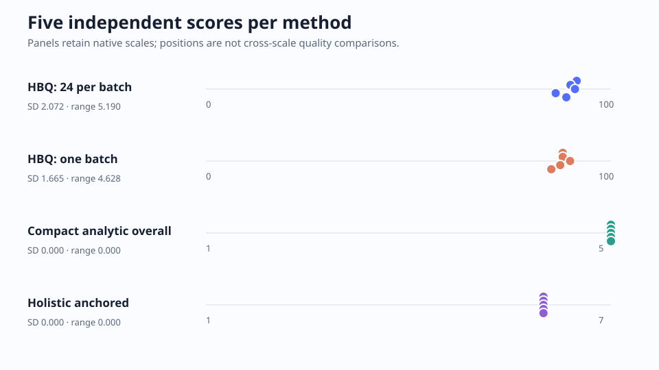
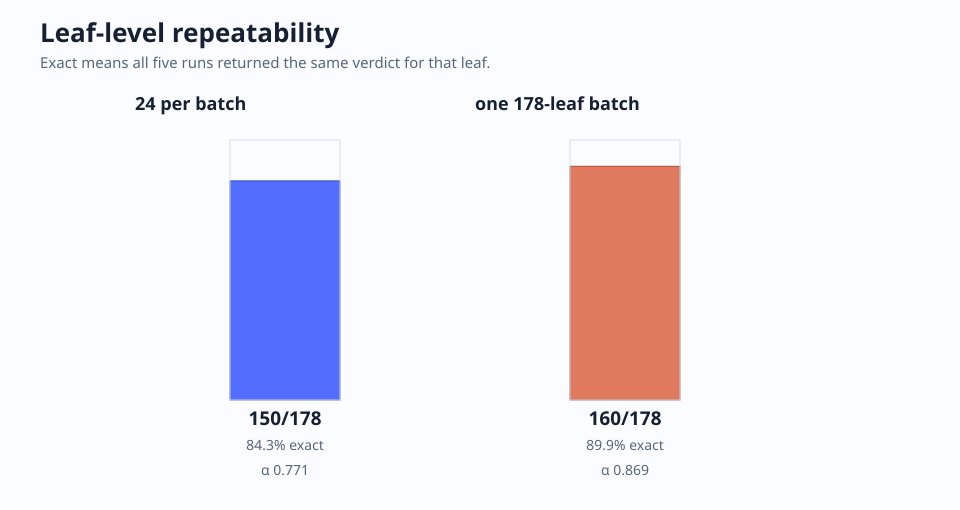
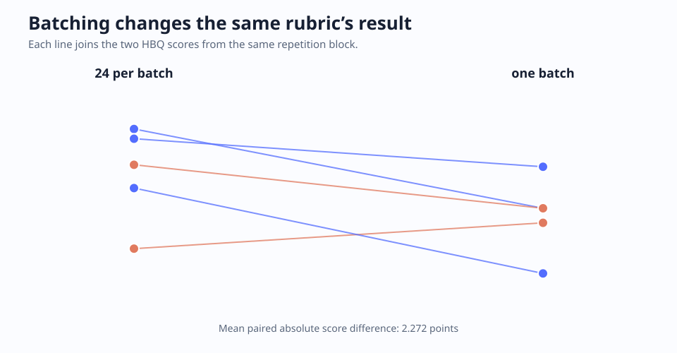

# Initial batching study: *The Part That Arrives First*

This initial case study asks a narrow question: when the same GPT-5.6 Sol judge reads the same complete story several times, how stable are its ratings under different rubric shapes and HBQ batching choices? For the current stricter comparison against research implementations derived from published rubrics, see the completed [established-rubric repeatability study v4](established-v4/).

The repository owner supplied the story and explicitly authorized publishing it in full. Read [the complete source](source.md), the [frozen study contract](study-contract.json), or any of the [published run outputs](results/).

## Design

The contract was frozen before execution. Each arm ran five times in a fresh Codex session with tools and network access disabled. Runs used `gpt-5.6-sol`: Medium reasoning for the 178 HBQ leaves and High reasoning for the two coarser comparators. There was no temperature or seed control and no result-driven stopping.

| Arm | Shape | Native output |
| --- | --- | --- |
| HBQ, 24 leaves per batch | `prose.short_story`, the same 178 leaves on every run | deterministic 0–100 aggregation |
| HBQ, one large batch | the same 178 leaves in the same order | deterministic 0–100 aggregation |
| Compact analytic | six independently synthesized anchored dimensions | six 1–5 ratings plus an overall 1–5 rating |
| Holistic anchored | one independently synthesized whole-story judgment | one 1–7 rating |

The comparator prompts use recurring constructs from established narrative-writing rubrics as design references, but their wording and schemas are original to this study. References: [NAPLAN narrative marking guide](https://www.nap.edu.au/docs/default-source/naplan/narrative-writing-marking-guide.pdf?sfvrsn=c85435e_2), [Oregon narrative writing scoring guide](https://www.oregon.gov/ode/educator-resources/essentialskills/ScoringGuides/wriscorguide_narrative_eng.pdf), [Cambridge English mark scheme](https://www.cambridgeinternational.org/Images/521329-june-2024-mark-scheme-paper-21.pdf), and [NZQA crafted writing standard](https://www.nzqa.govt.nz/nqfdocs/ncea-resource/achievements/2019/as91101.pdf).

## Results

| Method | Headline values across five runs | Repeatability |
| --- | --- | --- |
| HBQ, 24 per batch | 91.55, 89.99, 91.12, 86.36, 88.98 | 150/178 leaves agreed on all five runs (84.3%); mean modal agreement 95.3%; nominal Krippendorff α 0.771; score SD 2.072 |
| HBQ, one batch | 88.11, 88.11, 89.91, 87.47, 85.28 | 160/178 leaves agreed on all five runs (89.9%); mean modal agreement 97.2%; nominal α 0.869; score SD 1.665 |
| Compact analytic | overall 5, 5, 5, 5, 5 | five of six dimensions were identical; narrative architecture alternated between 4 and 5 |
| Holistic anchored | 6, 6, 6, 6, 6 | identical headline rating on every run |

“All-five agreement” means every repetition returned the same verdict for that individual leaf. Modal agreement gives partial credit when four of five agree. Alpha also accounts for the observed label prevalence. The native scales are deliberately not converted into one another.





The coarse methods look perfectly stable at headline level, but they also hit a ceiling: every holistic result was 6/7 and every analytic overall was 5/5. HBQ exposes much more of the judgment surface. Its verdicts were still strongly concentrated—95.3% or 97.2% mean modal agreement—while retaining visible disagreements that a single rating cannot show.

### Batching mattered

The one-batch HBQ arm was more repeatable in this case, not less. Its exact leaf agreement was 5.6 percentage points higher, its alpha was 0.098 higher, and its score SD was 0.407 lower. The two HBQ modes agreed on 92.6% of leaves within paired repetitions, but the 24-per-batch score averaged 1.824 points higher; the mean paired absolute difference was 2.272 points.



That is a method effect worth controlling. It does not establish that larger batches are universally better. It does mean a benchmark should freeze batch size, and calibration should resemble the intended production call shape.

## What HBQ caught

The detailed craft findings are useful beyond this batching experiment. [Read the illustrated findings separately](hbq-findings.md); this study keeps only the repeatability evidence behind them.

## Evidence discipline

The published result files preserve every rating and concise justification. An automated check also asked whether text placed in each evidence `quote` field was an exact substring of the source. Exact-match rates were 64.1% for 24-leaf HBQ batches, 71.0% for the single HBQ batch, 86.7% for compact analytic, and 80.0% for holistic. The misses include paraphrases placed in quote-shaped fields, ellipses joining non-contiguous text, and a few encoding substitutions. They do not silently become source quotations. The result is a concrete reason to validate evidence objects separately from verdict schemas.

## Reproduce and inspect

The public analysis is deterministic once the private raw run directories exist:

```bash
python evaluation-results/the-part-that-arrives-first-repeatability/analyze_study.py \
  --work-dir /path/to/completed-study-work \
  --output-dir /tmp/repeatability-results
```

The [runner](run_study.py), [strict comparator prompts and schemas](arms/), [summary](results/summary.json), [per-leaf repeatability table](results/leaf-repeatability.json), run outputs, hashes, and sanitized provider provenance are all included. One story, one judge configuration, and five repetitions support a descriptive case study—not a universal ranking of rubric systems, a human gold standard, or proof that repeatability equals validity.
