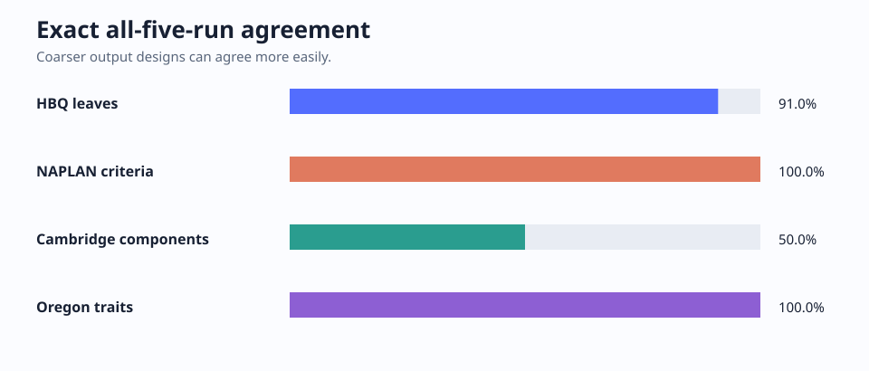

# Established-rubric repeatability study v4

We scored [The Part That Arrives First](../source.md) five times with GPT-5.6 Sol at high reasoning, using HBQ-RS and three research implementations of published rubrics. Each judgment used a fresh session. The [study contract](study-contract.json) fixes the story, prompts, schemas, settings, order, and five-run stopping rule.

## Results

| Method | Five results | Repeatability |
| --- | --- | --- |
| HBQ-RS `prose.short_story` | 88.5994, 92.7236, 86.5380, 94.8341, 90.6869 | 91.01% of 178 leaves agreed in all five runs; mean modal-label proportion 97.08%; nominal Krippendorff alpha 0.8617 |
| NAPLAN narrative implementation | 47, 47, 47, 47, 47 | All ten criteria agreed; three initial responses were rejected for non-contiguous quotations and corrected on retry |
| Cambridge IGCSE 0500 composition implementation | 40, 40, 39, 40, 39 | `style_and_accuracy` stayed at 24; `content_and_structure` varied between 15 and 16 |
| Oregon narrative implementation | 36, 36, 36, 36, 36 | All six traits agreed; three responses were rejected for non-contiguous quotations and corrected on retry |

### How often did the judge agree with itself?

| Method | All five agree | Pairwise repeat agreement | Judgments matching the modal value |
| --- | ---: | ---: | ---: |
| HBQ-RS leaves | 162/178 (91.01%) | 1,695/1,780 (95.22%) | 864/890 (97.08%) |
| NAPLAN criteria | 10/10 (100%) | 100/100 (100%) | 50/50 (100%) |
| Cambridge components | 1/2 (50%) | 14/20 (70%) | 8/10 (80%) |
| Oregon traits | 6/6 (100%) | 60/60 (100%) | 30/30 (100%) |

HBQ’s strict measure marks a leaf non-unanimous after any differing label. The modal distribution was 162 leaves at 1.0, seven at 0.8, eight at 0.6, and one at 0.4. Nominal Krippendorff alpha was **0.8617**.

### How much did scores move?

Raw points are misleading when scales have different widths. Here, standard deviation, mean absolute pairwise difference (MAPD), and range are divided by each scale’s width.

| Method | Scale and width | SD / width | MAPD / width | Range / width |
| --- | ---: | ---: | ---: | ---: |
| HBQ-RS | 0–100; width 100 | 3.276% | 4.143% | 8.296% |
| NAPLAN | 0–47; width 47 | 0% | 0% | 0% |
| Cambridge | 0–40; width 40 | 1.369% | 1.500% | 2.500% |
| Oregon | 6–36; width 30 | 0% | 0% | 0% |

HBQ’s observed score averaged **90.6764**. Cambridge averaged 39.6; its `style_and_accuracy` component stayed at 24, while `content_and_structure` was 16, 16, 15, 16, 15.

### Where the scale ran out of room

| Method | Total scores at ceiling | Mean total gap from ceiling | Criterion observations at ceiling | Summed criterion gap |
| --- | ---: | ---: | ---: | ---: |
| HBQ-RS | 0/5 | 9.3236 | n/a | n/a |
| NAPLAN | 5/5 | 0 | 50/50 | 0 |
| Cambridge | 3/5 | 0.4 | 8/10 | 2 |
| Oregon | 5/5 | 0 | 30/30 | 0 |

HBQ leaves are binary decisions, not ordinal criterion scores, so a leaf-level ceiling count would be meaningless. NAPLAN and Oregon hit the ceiling at both the total and criterion levels. Their zero variance shows consistency on this story, but cannot show how well either rubric separates strong work near the top. Cambridge was close to the ceiling too.

### Format corrections

| Method | Accepted model calls | Rejected calls | Quote-to-summary corrections | Extra calls after rejection |
| --- | ---: | ---: | ---: | ---: |
| HBQ-RS | 30 | 0 | 62 | 0 |
| NAPLAN | 5 | 3 | 0 | 3 |
| Cambridge | 5 | 0 | 0 | 0 |
| Oregon | 5 | 3 | 0 | 3 |

HBQ retained 854 grounded quotations and 266 summaries. Sixty-two would-be quotations were not exact, so the runner kept the evidence but labeled it as summary instead; no verdict or model call changed. The other rubrics require a contiguous quotation for every component, so six responses were retried: three in NAPLAN and three in Oregon.




## What this can tell us

This is one strong story judged five times, and all three native totals were at or within one point of their ceilings. It tells us about repeatability on this case, not which rubric is “best,” whether any rubric is valid in general, or how trained markers would score the story. The scales stay separate; their totals are never averaged with or ranked against an HBQ percentage. The three comparators are research implementations, not official scores.

## Data

- [summary.json](results/summary.json): scores, agreement metrics, and retries
- [derived-repeatability.json](results/derived-repeatability.json): the calculations behind the tables above
- [hbq-leaf-repeatability.json](results/hbq-leaf-repeatability.json): all 178 five-label series
- [provenance.json](results/provenance.json) and [publication-manifest.json](results/publication-manifest.json): verification records

To verify the package:

```console
python evaluation-results/the-part-that-arrives-first-repeatability/established-v4/results/verify_results.py
pytest -q tests/test_established_repeatability_v4_results.py
```
